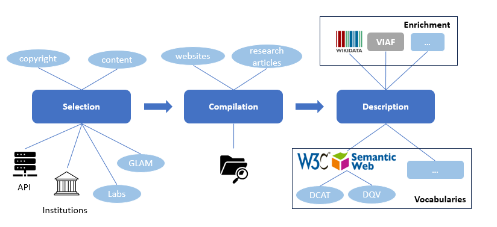
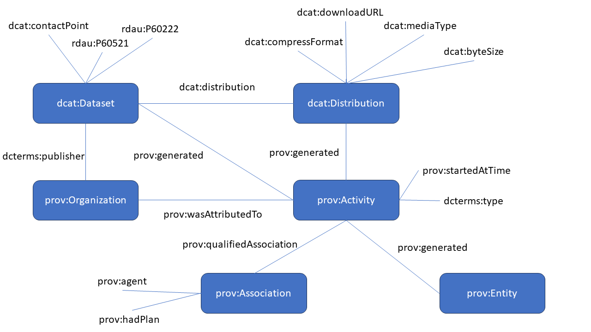

# DCAT-GLAM-catalog

This project introduces examples of GLAM datasets provided by institutions described using the [Data Catalog Vocabulary](https://www.w3.org/TR/vocab-dcat-3/).

This list intends to be a representative sample providing a wide diversity of collections with different content, license and origins in order to encourage institutions to adopt semantic and interoperable standards to describe their datasets to be prepared for the new technological context in which [data spaces will play a relevant role](https://doi.org/10.1007/978-3-031-21756-2_41).

## Framework to transform the GLAM datasets
This work proposes a framework that works in three steps (selection, compilation and description) in order to describe the datasets using the DCAT vocabulary. 

## Data modelling
The description of the datasets has been performed based on the vocabulary DCAT. Additional vocabularies have been used such as [PROV-O](https://www.w3.org/TR/prov-o/), [SKOS](https://www.w3.org/TR/skos-reference/) and [DCterms](https://www.dublincore.org/specifications/dublin-core/dcmi-terms/). 

Additional properties have been used from other vocabularies such as [RDAU](http://www.rdaregistry.info/Elements/u/) to describe the examples of use and prototypes as well as the inclusion of terms of use.

## Applying the framework: selection of datasets

This is the list of examples provided by GLAM institutions that haven been transformed into the [Data Catalog Vocabulary](https://www.w3.org/TR/vocab-dcat-3/). The information to describe the datasets has been retrieved from websites, research articles and projects. In some cases, the DCAT model has been used only too some extent due to the lack of information provided by the institutions regarding the datasets. 

- [British Library - Free dataset downloads (Alexander the Great and Shakespeare)](datasets/bl.ttl)
- [Digital Library of the Caribbean - Panama American - Aruba Esso News](datasets/caribbean.ttl)
- [Europeana - Downloads (Theater Posters and National Heritage Institute Bucharest)](datasets/europeana.ttl)
- [Harvard Art Museums API](datasets/harvard.ttl)
- [Library of Congress - Chronicling America](datasets/lc.ttl)
- [Metropolitan Museum of Art - Collection API](datasets/moma.ttl)
- [National Library of France - Mandragore](datasets/bnf.ttl)
- [National Library of Luxembourg - Historical Newspapers](datasets/bnl.ttl)
- [National Library of Scotland - Moving Image Archive - A Medical History of British India](datasets/data-foundry-nls.ttl)
- [National Library of the Netherlands - Dutch Novels 1800-2000](datasets/kb.ttl)
- [Rijksmuseum - Actors - Thesauri](datasets/rijksmuseum.ttl)
- [South Australian Museum - Minerals Collection](datasets/sam.ttl)
- [Zeri Photo Archive - Zeri&LOD](datasets/zeri.ttl)

Note that only a small portion of datasets per institution has been selected and transformed to DCAT in order to show how to describe the datasets using semantic vocabularies. The entire collection of datasets is available in [this file](catalog.ttl).

  
## Exploring the collection of datasets using Jupyter Notebooks

An reproducible example based on the use of [Jupyter Notebooks](https://jupyter.org/) is provided in order to show how the data can be queried using [SPARQL](https://www.w3.org/TR/sparql11-query/) as main vocabulary.

- [dcat-SPARQL Jupyter Notebook](https://nbviewer.org/github/hibernator11/dcat-catalog/blob/main/notebooks/dcat-SPARQL.ipynb)

## Visualisations

The enrichement by means of external repositories such as [Wikidata](https://www.wikidata.org) facilitates the creation of visualisations (avoiding the installation of additional software). For example, the GLAM organisations that made available the datasets used in this work can be retrieved using their [Wikidata](https://www.wikidata.org) identifiers in order to create a map as a [visualisation example](https://w.wiki/6$oU).

## Future work

These are potential ideas to improve this work:

- Increase the number of datasets per institutions
- Include additional GLAM institutions
- Describe with additional details (data quality, provenance, etc.)
- Improve the metadata related to data quality
- Create an interface to describe the datasets

## References

- Gustavo Candela, Nele Gabriëls, Sally Chambers, Thuy-An Pham, Sarah Ames, Neil Fitzgerald, Katrine Hofmann, Victor Harbo, Abigail Potter, Meghan Ferriter, Eileen Manchester, Alba Irollo, Ellen Van Keer, Mahendra Mahey, Olga Holownia, Milena Dobreva: A Checklist to Publish Collections as Data in GLAM Institutions. CoRR abs/2304.02603 (2023)
- Candela, G. (2023). Towards a semantic approach in GLAM Labs: The case of the Data Foundry at the National Library of Scotland. Journal of Information Science, 0(0). https://doi.org/10.1177/01655515231174386
- Chambers, Sally, Walsh, Melanie, Caswell, Michelle, Harder, Geoff, Okumura, Mercedes, Corrin, Julia, Baeza Ventura, Gabriela, Antonijevic, Smiljana, Knazook, Beth, Narlock, Mikala, Bailey, Jefferson, Neudecker, Clemens, Downie, J. Stephen, Layne-Worthey, Glen, van Strien, Daniel, Irollo, Alba, Whitmire, Amanda, Lee, James, Berry, Dorothy, … Ridge, Mia. (2023). Position Statements -> Collections as Data: State of the field and future directions (Version 1). Zenodo. https://doi.org/10.5281/zenodo.7897735
- Padilla, Thomas, Allen, Laurie, Frost, Hannah, Potvin, Sarah, Russey Roke, Elizabeth, & Varner, Stewart. (2019). Final Report --- Always Already Computational: Collections as Data (Version 1). Zenodo. https://doi.org/10.5281/zenodo.3152935
- Milena Dobreva, Krassen Stefanov, and Krassimira Ivanova. 2022. Data Spaces for Cultural Heritage: Insights from GLAM Innovation Labs. In From Born-Physical to Born-Virtual: Augmenting Intelligence in Digital Libraries: 24th International Conference on Asian Digital Libraries, ICADL 2022, Hanoi, Vietnam, November 30 – December 2, 2022, Proceedings. Springer-Verlag, Berlin, Heidelberg, 492–500. https://doi.org/10.1007/978-3-031-21756-2_41
- Mahey, M., Al-Abdulla, A., Ames, S., Bray, P., Candela, G., Chambers, S., Derven, C., Dobreva-McPherson, M., Gasser, K., Karner, S., Kokegei, K., Laursen, D., Potter, A., Straube, A., Wagner, S-C. and Wilms, L. with forewords by: Al-Emadi, T. A., Broady-Preston, J., Landry, P. and Papaioannou, G. (2019) Open a GLAM Lab. Digital Cultural Heritage Innovation Labs, Book Sprint, Doha, Qatar, 23-27 September 2019. http://dx.doi.org/10.21428/16ac48ec.f54af6ae
- Timnit Gebru, Jamie Morgenstern, Briana Vecchione, Jennifer Wortman Vaughan, Hanna M. Wallach, Hal Daumé III, Kate Crawford:
Datasheets for datasets. Commun. ACM 64(12): 86-92 (2021). https://doi.org/10.48550/arXiv.1803.09010
