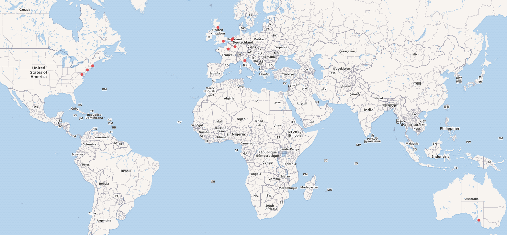

# dcat-catalog

Examples of GLAM datasets described using the [Data Catalog Vocabulary](https://www.w3.org/TR/vocab-dcat-3/).

## Collection of datasets

This is the list of examples provided by GLAM institutions that haven been transformed into the [Data Catalog Vocabulary](https://www.w3.org/TR/vocab-dcat-3/). The information to describe the datasets has been retrieved from websites, research articles and projects. In some cases, the DCAT model has been used only too some extent due to the lack of information provided by the institutions regarding the datasets.

- [British Library - Free dataset downloads](datasets/bl.ttl)
- [Digital Library of the Caribbean - Panama American](datasets/caribbean.ttl)
- [Europeana - Downloads](datasets/europeana.ttl)
- [Harvard Art Museums API](datasets/harvard.ttl)
- [Library of Congress - Chronicling America](datasets/lc.ttl)
- [Metropolitan Museum of Art - Collection API](datasets/moma.ttl)
- [National Library of France - Mandragore](datasets/bnf.ttl)
- [National Library of Luxembourg - Historical Newspapers](datasets/bnl.ttl)
- [National Library of Scotland - Moving Image Archive - A Medical History of British India](datasets/data-foundry-nls.ttl)
- [National Library of the Netherlands - Dutch Novels 1800-2000](datasets/kb.ttl)
- [Rijksmuseum - Actors - Thesauri](datasets/rijksmuseum.ttl)
- [South Australian Museum - Minerals Collection](datasets/sam.ttl)
- [Zeri Photo Archive](datasets/zeri.ttl)

Note that only a small portion of datasets per institution has been selected. 
  
## Exploring the collection of datasets using Jupyter Notebooks

- [dcat-SPARQL](https://nbviewer.org/github/hibernator11/dcat-catalog/blob/main/notebooks/dcat-SPARQL.ipynb)

## Visualisations

- The organisations used in this work can be retrieved using their [Wikidata](https://www.wikidata.org) identifiers in order to create a map as a [visualisation example](https://w.wiki/6$oU).

## References

- Gustavo Candela, Nele Gabriëls, Sally Chambers, Thuy-An Pham, Sarah Ames, Neil Fitzgerald, Katrine Hofmann, Victor Harbo, Abigail Potter, Meghan Ferriter, Eileen Manchester, Alba Irollo, Ellen Van Keer, Mahendra Mahey, Olga Holownia, Milena Dobreva: A Checklist to Publish Collections as Data in GLAM Institutions. CoRR abs/2304.02603 (2023)
- Candela, G. (2023). Towards a semantic approach in GLAM Labs: The case of the Data Foundry at the National Library of Scotland. Journal of Information Science, 0(0). https://doi.org/10.1177/01655515231174386
- Chambers, Sally, Walsh, Melanie, Caswell, Michelle, Harder, Geoff, Okumura, Mercedes, Corrin, Julia, Baeza Ventura, Gabriela, Antonijevic, Smiljana, Knazook, Beth, Narlock, Mikala, Bailey, Jefferson, Neudecker, Clemens, Downie, J. Stephen, Layne-Worthey, Glen, van Strien, Daniel, Irollo, Alba, Whitmire, Amanda, Lee, James, Berry, Dorothy, … Ridge, Mia. (2023). Position Statements -> Collections as Data: State of the field and future directions (Version 1). Zenodo. https://doi.org/10.5281/zenodo.7897735
- Padilla, Thomas, Allen, Laurie, Frost, Hannah, Potvin, Sarah, Russey Roke, Elizabeth, & Varner, Stewart. (2019). Final Report --- Always Already Computational: Collections as Data (Version 1). Zenodo. https://doi.org/10.5281/zenodo.3152935
- Mahey, M., Al-Abdulla, A., Ames, S., Bray, P., Candela, G., Chambers, S., Derven, C., Dobreva-McPherson, M., Gasser, K., Karner, S., Kokegei, K., Laursen, D., Potter, A., Straube, A., Wagner, S-C. and Wilms, L. with forewords by: Al-Emadi, T. A., Broady-Preston, J., Landry, P. and Papaioannou, G. (2019) Open a GLAM Lab. Digital Cultural Heritage Innovation Labs, Book Sprint, Doha, Qatar, 23-27 September 2019.
- Timnit Gebru, Jamie Morgenstern, Briana Vecchione, Jennifer Wortman Vaughan, Hanna M. Wallach, Hal Daumé III, Kate Crawford:
Datasheets for datasets. Commun. ACM 64(12): 86-92 (2021)
